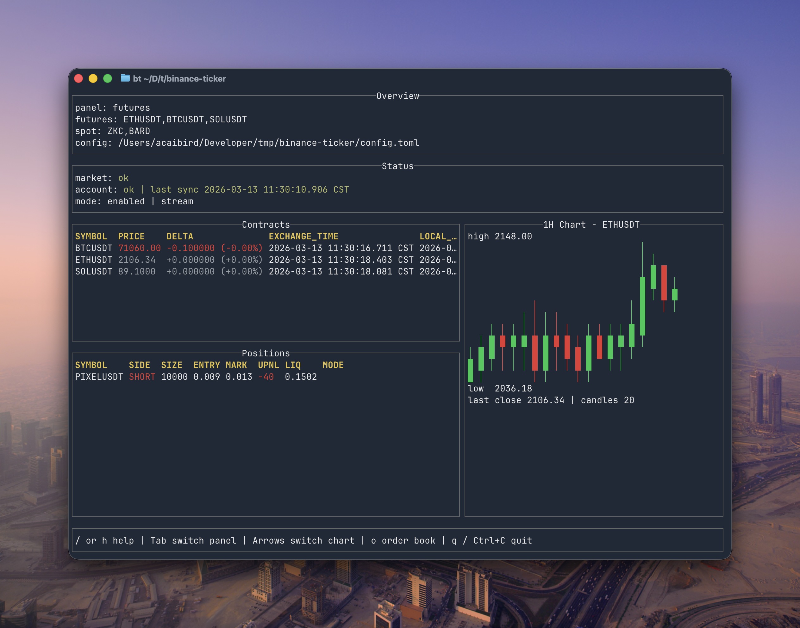
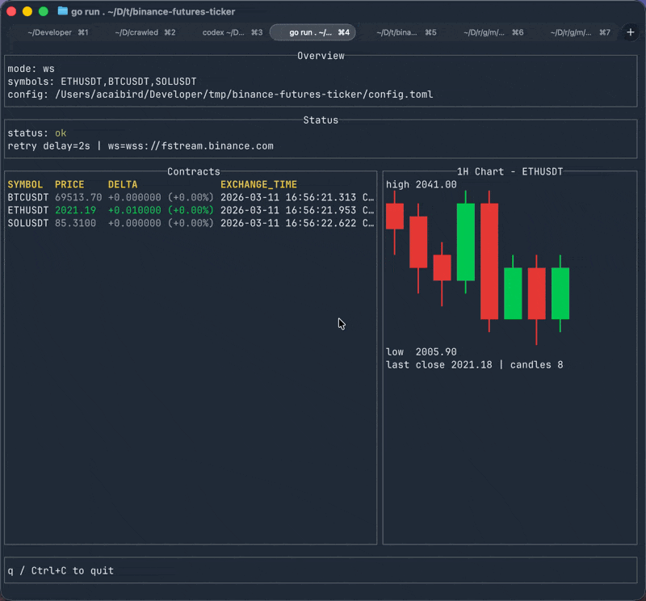

# Binance Ticker

[English README](./README.md)

`binance-ticker` 是一个使用 Go 编写的币安终端查看工具，支持合约与现货实时行情监控以及 1 小时 K 线图展示，界面基于 `tview/tcell`。

## 预览





## 功能

- 通过 Binance WebSocket 实时订阅币安合约与现货行情
- 支持合约与现货实时更新的 1 小时 K 线图，并可用键盘切换图表 symbol
- 基于 `tview/tcell` 的稳定 TUI 界面
- 涨跌使用绿色和红色高亮
- 内置帮助面板，展示快捷键说明
- 仅通过 TOML 配置文件驱动

## 配置文件

程序只读取配置文件，不接受运行时命令行参数。

默认按以下顺序查找配置文件：

1. `./config.toml`
2. `~/.config/binance-ticker/config.toml`

如果没有找到配置文件，或者缺少任何必填字段，程序会直接报错退出。

仓库中提供了示例配置：[config.example.toml](./config.example.toml)

## 安装

### Homebrew（macOS / Linux）

```bash
brew tap byteoxo/tap
brew install binance-ticker
```

### 下载预编译二进制

从 [Releases](https://github.com/byteoxo/binance-ticker/releases) 页面下载对应平台的压缩包。

### 从源码编译

```bash
git clone https://github.com/byteoxo/binance-ticker.git
cd binance-ticker
go build -o binance-ticker .
./binance-ticker
```

## 配置字段

- `symbols`：要订阅的合约列表，例如 `['ETHUSDT', 'BTCUSDT']`
- `spot_symbols`：要展示的现货资产列表，例如 `['ZKC', 'BARD']`
- `chart_symbol`：启动时合约 1 小时 K 线图默认使用的 symbol
- `chart_limit`：图表展示的 1 小时 K 线数量
- `default_panel`：默认打开 `futures` 或 `spot`
- `timeout`：HTTP/WebSocket 超时，例如 `8s`
- `retry_delay`：WebSocket 断线后重连等待时间，例如 `2s`
- `tz`：界面显示时区，例如 `Asia/Shanghai`
- `rest_base`：Binance REST API 基地址
- `ws_base`：Binance WebSocket 基地址
- `no_color`：是否禁用 TUI 颜色

## 快捷键

- `/` 或 `h`：打开/关闭帮助面板
- `Up` / `Left`：切换到上一个图表 symbol
- `Down` / `Right`：切换到下一个图表 symbol
- `q`：退出
- `Ctrl+C`：退出

## 示例配置

```toml
symbols = ["ETHUSDT", "BTCUSDT", "SOLUSDT"]
chart_symbol = "ETHUSDT"
chart_limit = 48
timeout = "8s"
tz = "Asia/Shanghai"
rest_base = "https://fapi.binance.com"
ws_base = "wss://fstream.binance.com"
no_color = false
retry_delay = "2s"
```
